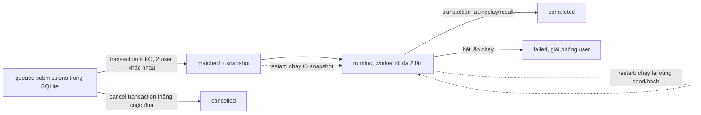

# Thiết kế Mốc 2 — hàng chờ và trận official bền vững

Phạm vi lấy từ [M2_PRD.md](M2_PRD.md), các quyết định backend tại [M0_RELEASE.md](M0_RELEASE.md), và luồng M1 hiện có. Runtime phát hành là Node 22 + `node:sqlite` trên VPS; không đổi engine, Vercel, Google auth hoặc nhà cung cấp. Migration phải giữ mọi dữ liệu M1; không giả định DB rỗng. Thiết kế này không cho phép production deploy.

## Quyết định kiến trúc

- `submissions` là nguồn duy nhất của queue: `queued` sắp FIFO theo `(created_at, id)`. `waiting_submissions` hiện tách ở cùng SQLite nhưng không nằm trong transaction với submissions/replay; migration đổi tên thành `waiting_submissions_m1_legacy` để giữ bằng chứng cũ, runtime không đọc/ghi bảng này nữa.
- Thêm `official_matches` trong cùng SQLite. Một giao dịch ngắn `BEGIN IMMEDIATE` tạo submission, chọn cặp hai user khác nhau, lưu match snapshot và chuyển cả hai submission sang `matched`. Cancel cũng dùng giao dịch và chỉ chuyển đúng `queued`; SQLite tuần tự hóa hai cuộc đua này. Thêm `request_hash`, `submission_id` vào `idempotency_keys`; REST và MCP submit cùng dùng khóa `tool_name='submit_bot'`, lưu khóa và submission trong cùng giao dịch.
- Snapshot bất biến giữ submission/user/version IDs, hai package đã validate và hash, seed, engine/ruleset version. Dùng replay ID làm match ID để duy trì các `match_id` M1 đang trỏ tới replay. Một unique partial index cho `submissions.status IN ('queued','matched','running')` giữ giới hạn một lượt active/user.
- Node chạy tối đa một official match worker tại một thời điểm, dùng `scripts/run-isolated.mjs` hiện có để simulation không chặn API event loop. Không thêm dependency hay thay engine. Giao dịch cuối lưu replay, result và trạng thái `completed` của match/cả hai submissions cùng lúc; ID, seed và snapshot không đổi khi thử lại. Worker error/restart được tính vào giới hạn hai lần chạy (lần đầu + tối đa một retry); hết retry thì cập nhật cả hai submissions thành `failed` với mã/lý do an toàn, không lưu stack trace cho client.
- Khi khởi động, Node tiếp tục `queued`, chạy `matched`, và chạy lại `running` từ đúng snapshot/seed. Nếu match đã có replay thì chỉ hoàn tất các trạng thái còn thiếu trong cùng transaction; unique replay ID chặn replay official thứ hai. Match không thể phục hồi sau hai lần chạy chuyển `failed` thay vì treo.
- `/api/simulate` luôn gọi `makeReplay(..., false)` và trả `mode: "test"`; bỏ qua hoặc từ chối trường `mode` do caller gửi. Chỉ submit đã xác thực mới vào queue official.

## Dữ liệu và hợp đồng API

Migration `0004` thêm bảng `official_matches` với tối thiểu: `id`, hai submission/user/version IDs, `snapshot_json`, `seed`, `engine_version`, `ruleset_version`, `status`, `attempts`, `error_code`, `error_message`, `result_json`, `created_at`, `updated_at`. `submissions` thêm `error_code`, `error_message`, `updated_at`; `idempotency_keys` thêm `request_hash` và `submission_id`. Trạng thái hợp lệ trong xử lý mới là `queued|matched|running|completed|failed|cancelled`. Replay vẫn dùng schema M0/M1 hiện có (`ReplayData`, `MatchResult`); không sửa `packages/core`.

| Request | Hành vi / phản hồi |
|---|---|
| `POST /api/v1/bots/{id}/submit` `{revision}` + `Idempotency-Key` | Bắt buộc phiên Google, bot thuộc user, revision hiện tại và server validation pass. Trả `202 {submissionId,status,createdAt,matchId?}`. Key 8–128 ký tự an toàn, duy nhất theo user+submit; cùng key/cùng `(botId,revision)` luôn trả cùng ID; cùng key/khác bot hoặc revision trả `409`. Yêu cầu mới khi user còn active trả `409`. Header được thêm vào CORS preflight. Tính fingerprint trước transaction; trong transaction đọc/ghi khóa `submit_bot`, tạo submission và pair atomically. |
| `GET /api/v1/submissions?cursor=&limit=`; `GET /api/v1/submissions/{id}` | Chỉ trả lượt của user hiện tại; danh sách dùng `items`, `nextCursor`, giới hạn 1–50; detail gồm ID, status, thời điểm, lỗi public, `matchId`, position khi `queued`, và result/replay URL khi hoàn tất. Không trả email hay thông tin đối thủ ngoài dữ liệu replay mà người tham gia được phép xem. |
| `POST /api/v1/submissions/{id}/cancel` | Lặp sau khi đã `cancelled` trả cùng trạng thái. Chỉ `queued` hủy được. Nếu ghép đã commit trước, trả `409` cùng status hiện tại. Không xóa row. |
| `GET /api/v1/matches/{id}` | Chỉ một trong hai user tham gia được đọc. Trả `matchId,status,createdAt,seed,engineVersion,rulesetVersion,packageHashes,result?,replayId?`; không trả email. Người không tham gia nhận `404`. |
| `GET /api/v1/replays/{id}` | Replay test tiếp tục chỉ cho chủ sở hữu; replay official chỉ cho hai participant qua liên kết `official_matches`, bất kể `official=1`. Người không tham gia nhận `404`. |
| `POST /api/v1/replays/{id}/share` | Người tham gia tạo link xem đúng replay này, ký bằng secret hiện có, hết hạn sau 24 giờ. Reuse `/replays/{id}?share=...`; chữ ký gắn replay ID, chỉ cấp quyền viewer, phản hồi `no-store` + `Referrer-Policy: no-referrer`. Link sai/hết hạn bị từ chối. |

MCP `submit_bot` gọi đúng luồng submit/idempotency/status trên, không gọi Durable Object hoặc tự tính trận official. `idempotencyKey` của MCP map vào cùng key DB; các `submit_bot` key cũ được giữ nguyên và backfill từ response/submission nếu khớp được bot/revision, nếu không thì từ chối dùng lại key thay vì tạo lượt khác. Bổ sung MCP `list_submissions`, `get_submission`, `cancel_submission`; response dùng cùng submission view và result. MCP `get_replay` dùng participant gate như REST. Simulation thử qua MCP và web vẫn lưu `test`.

Web đăng nhập dùng bot/version cloud đã validate và API official; không gọi `submitOwn/takePair` hoặc `maybeMatch` cho official. Lượt local vẫn trong `localStorage` nhưng tab Hàng chờ tách rõ “Official trên tài khoản” / “Thử trên thiết bị này”. Tải trang lấy API state; khi tab hiển thị poll 2–3 giây, backoff khi lỗi, dừng tab ẩn và refresh khi quay lại. Persist một idempotency key pending đến khi server trả submission ID; lần nộp mới sau trạng thái cuối dùng key mới. Các status/error hiển thị tiếng Việt, chỉ hiện Hủy khi `queued` và Xem replay khi `completed`.

## Migration, backup và rollback

`apps/api/src/node.mjs` chỉ chạy migration theo thứ tự/version: 0001 → 0002 nếu DB dưới v2 → 0003 nếu dưới v3 → 0004 nếu dưới v4. Bổ sung transaction callback đồng bộ lên Node DB adapter để các thay đổi liên quan được nhóm trong `BEGIN IMMEDIATE`; không `await` simulation/network trong callback. Không chạy lại 0002 sau khi 0004 đã đổi tên bảng queue cũ. Migration 0004 ở trong `BEGIN IMMEDIATE`; cập nhật `user_version=4` cuối cùng. Mọi DDL/data copy/index tạo đều rollback nếu một bước lỗi.

Trong transaction 0004:

1. Giữ nguyên users, bots, bot_versions, replays và mọi submission. Với cặp `matched` cũ, chỉ ánh xạ sang `completed` khi có đúng hai submission của hai user khác nhau và replay official hợp lệ cùng `match_id`; tạo match completed từ replay manifest + versions. Replay/ID hiện có không bị đổi.
2. `queued` hợp lệ tiếp tục queued, dù thiếu row trong bảng queue cũ; queue mới dựng từ submissions. Queue cũ có thể khôi phục (submission bị thiếu nhưng user/version còn và cùng chủ) được chép thành submission cùng ID. Trường hợp không thể khôi phục thì để nguyên trong bảng đã đổi tên và ghi lý do kiểm kê; không xóa dữ liệu nguồn.
3. Submission `matched` không ghép được với participant/replay hợp lệ chuyển `failed` với lý do migration; giữ lại submission/replay cũ. Nếu sau ánh xạ còn nhiều active cùng user, giữ lượt queued sớm nhất theo `(created_at,id)`, kết thúc các lượt queued dư thành failed có lý do.
4. Sau reconciliation mới tạo unique partial index active/user và đổi tên `waiting_submissions` thành `waiting_submissions_m1_legacy`.

Trước deploy tương lai: dừng service hoặc lấy SQLite backup nhất quán (bao gồm WAL), lưu bản code/env tương ứng, chạy preflight read-only cho `user_version`, `integrity_check`, row counts, duplicate active, queued/matched/replay reconciliation. Migration tự chạy local/copy trước; so sánh mọi bảng nguồn, xác nhận `PRAGMA integrity_check = ok`, rồi mới tính đến production trong tác vụ có ủy quyền riêng. Rollback là dừng service và khôi phục snapshot DB + code/env trước migration; không chạy down migration phá dữ liệu. Đây là gate vận hành, không phải giả định VPS trống.

## Nhóm triển khai theo phụ thuộc

| ID / ưu tiên | File thuộc phạm vi | Điều kiện nghiệm thu |
|---|---|---|
| **M2-1 — P0, migration trước** | `apps/api/node-migrations/0004_official_matches.sql`, `apps/api/src/node.mjs`, `tests/api-queue.test.mjs` | DB fixture M1 có user/bot/version/replay, queued, matched, failed và MCP idempotency keys được nâng từ v3 lên v4; lịch sử được giữ, matched hợp lệ thành completed, row hỏng có lý do, unique active hoạt động, migration rerun an toàn, integrity `ok`. Chứng minh rollback trên DB tạm; production không đụng tới. |
| **M2-2 — P0, state/transaction** | `apps/api/src/index.mjs`, `apps/api/src/node.mjs`, `tests/api-queue.test.mjs` | 20 POST song song cùng key cho một ID; khác payload cùng key/active submission khác trả 409. Submit+pair+snapshot là một transaction; FIFO chỉ ghép hai user khác nhau. Cancel đối đầu submit thứ hai cho đúng một nhánh, không orphan hoặc nửa cặp. |
| **M2-3 — P0, runner/recovery/quyền** | `apps/api/src/index.mjs`, `apps/api/src/node.mjs`, `scripts/run-isolated.mjs`, `tests/api-queue.test.mjs` | Matched/running phục hồi từ snapshot bất biến, cùng seed/hash; tối đa một retry; cuối cùng hai submissions cùng completed/failed; replay insert/result/status atomic và không trùng. Người thứ ba bị 404 ở match/replay; participant xem được; share hợp lệ 24 giờ chỉ mở replay. `/api/simulate` luôn test. |
| **M2-4 — P0, Web/MCP** | `apps/api/src/index.mjs`, `apps/web/src/api.ts`, `apps/web/src/main.ts`, `apps/web/index.html`, `apps/web/lab.css`, `tools/m3-smoke.mjs`, `tools/m4-smoke.mjs` | Submit signed-in dùng cloud revision và idempotency header; reload lấy server state, cancel/result/replay theo status; local queue có nhãn thiết bị. MCP đọc cùng submission/match và tuân cùng quyền. Cập nhật smoke đang giả định submit thứ hai đồng bộ `matched` và replay official công khai; không đổi engine/UI dependencies. |
| **M2-5 — P0, xác minh** | `tests/api-queue.test.mjs` (hoặc một file test M2 nếu ownership tách), `tools/m3-smoke.mjs` | Integration trên Node/SQLite tạm cover idempotency concurrency, race cancel/match, participant/share auth, `mode=official`, restart ở queued/matched/running/completed, retry exhaustion, migration counts và `integrity_check`. Test hook chỉ inject simulator/failure trong harness Node test; không có route công khai. `pnpm check`, M3/M4 smoke pass. |

## Quy ước, giới hạn và rủi ro

- Dùng SQL prepared statements và kiểm tra `changes` từ conditional update; giữ transaction ngắn, không await simulation/network trong transaction. Public error dùng mã ổn định và nội dung ngắn; server log chi tiết, không trả stack/email/session/token.
- Giữ `checkOrigin` cho POST cookie auth; thêm `idempotency-key` vào `OPTIONS` CORS. API list/status/replay đặt `cache-control: no-store`. Owner checks dùng user ID session/MCP hiện có, không tin ID hoặc mode từ client.
- DB `node:sqlite`, `node:test`, Ajv/schema và `scripts/run-isolated.mjs` đã có; không thêm package. Có thể cập nhật API response TS trong `apps/web/src/api.ts`; không cần thay engine/replay version.
- VPS từng đo 1 vCPU; lịch sử M3 ghi p95 khoảng 25 giây ở 10 request đồng thời. Runner tuần tự giữ giới hạn tải, nhưng M2 không hứa thời gian hoàn thành khi tải tùy ý. Timeout/failure phải chuyển trạng thái có lý do, không để active vô hạn.
- Worker/D1 còn là tuyến legacy cho đến M3 kiểm tra traffic/client; M2 chỉ phát hành qua VPS Node. Không deploy M2 hoặc sửa/tắt Worker trong phần việc này.
